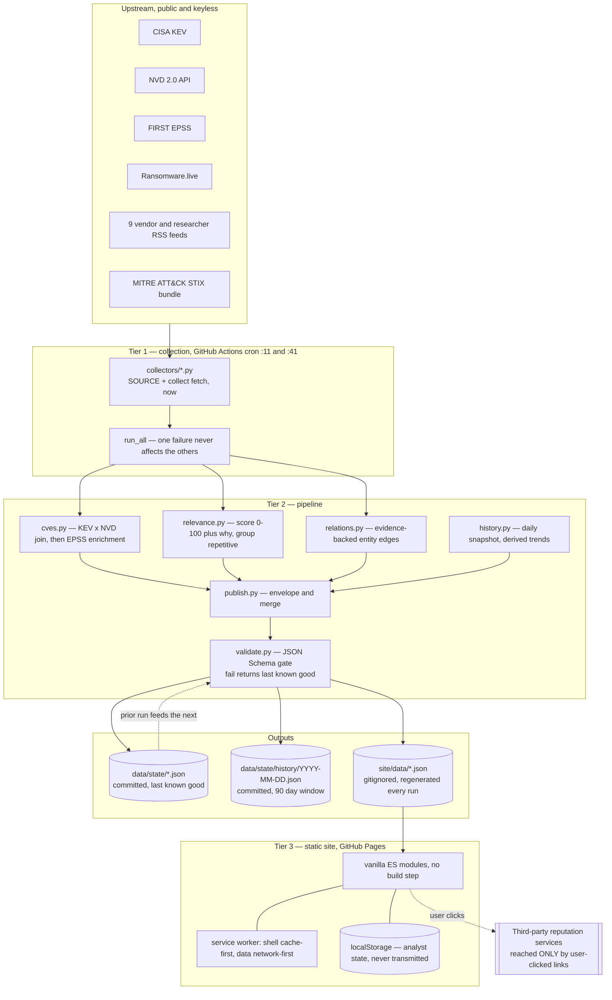

# SOCDesk — Architecture

How the system is put together, why it is shaped this way, and what the shape
costs. Read [COMPLIANCE.md](../COMPLIANCE.md) alongside this: several
architectural decisions here are licensing decisions wearing engineering
clothes.

## The constraint that produced the design

Zero infrastructure. No server, no database, no accounts, no bill. Everything
downstream follows from that:

- Collection has to happen somewhere that is free and scheduled — GitHub
  Actions cron.
- The output has to be a file, because a file is the only thing a static host
  can serve — JSON payloads under `site/data/`.
- Anything analyst-specific has to live in the browser, because there is
  nowhere else to put it — `localStorage`, via `site/js/state.js`.
- Freshness is bounded by the cron interval, not by request time. The UI is
  therefore obliged to always say how old the data is rather than imply live.

The second constraint is the aggregator rule: SOCDesk holds only data it may
clearly redistribute. Reputation corpora are reached by user-clicked deep links
at render time and never fetched by the page. This is enforced structurally by
the Content-Security-Policy (`connect-src 'self'`), not by convention.

## End to end

## Tier 1 — collection

`run_pipeline.py:50` is the orchestrator. It loads prior state, decides which
collectors to run, runs them, and hands the results to the pipeline.

**The collector contract.** A collector module exposes `SOURCE` (a short slug)
and `collect(fetch, now)` returning a `CollectorResult`
(`collectors/base.py:52`). `items` are normalised feed rows; `extra` is a
dict of side payloads the pipeline consumes by key (KEV rows, NVD rows, ATT&CK
profiles). `fetch` is injected — production passes `pipeline/http.py:6`, tests
pass a fixture stub, which is why the pytest suite runs offline.

**Fault isolation is the mechanism, not an aspiration.** `run_all`
(`collectors/base.py:78`) wraps every module in a try/except, converts a raised
exception into `ok=False` plus a truncated error string, and continues. A
collector cannot take down a sibling, the pipeline, or the deploy. Every run
produces one health entry per module regardless of outcome.

RSS goes one level further (`collectors/rss.py:51`): a single dead feed is
caught inside the loop and recorded in `error`, and the collector only raises
if *every* feed in the pool failed.

**ATT&CK is cached, not fetched every run.** The STIX bundle is large and
changes on a quarterly cadence, so `run_pipeline.py:45` skips it while
`actors.json` in state is newer than `attack.CACHE_DAYS` (7 days). It is listed
separately as `CACHED_COLLECTORS` in `collectors/__init__.py:10`.

**Normalisation and sanitisation happen at collection.**
`collectors/base.py:61` builds every feed item through one function: a SHA-1 id
derived from `source:native_id` (stable across runs, so dedup and analyst
"reviewed" marks survive), text reduced to inert plain text by `clean_text`,
and URLs filtered by `safe_url`. Both of those functions exist because upstream
strings are attacker-influenced and both previously shipped with working
bypasses — the comments at `collectors/base.py:16` and `:37` name them
specifically. The site escapes again at render time anyway
(`site/js/data.js:8`); the pipeline sanitising is not a licence to trust the
data downstream.

## Tier 2 — pipeline

Ordered by what depends on what:

1. **CVE join** (`pipeline/cves.py:22`). Merges prior rows, NVD rows, and KEV
   rows into one table keyed by CVE, retaining anything modified inside a
   180-day window plus every KEV row regardless of age. The NVD collector
   deliberately issues two queries — a recent-modified window *and* the whole
   KEV catalogue via `hasKev` (`collectors/nvd.py:21`) — because KEV spans
   2014 onward while the modified window is two days, and without the second
   query the KEV × CVSS join is a fiction.
2. **EPSS enrichment** (`pipeline/cves.py:53`). Batched 100 CVEs per request,
   mutating rows in place. It returns its own health entry, which is why
   `health.json` carries one more row than there are collector modules.
3. **Feed merge** (`pipeline/publish.py:26`). Prior items plus new items keyed
   by id, fresh wins, trimmed to a 30-day window, newest first. Timestamps are
   repaired on every merge, not only at collection (`publish.py:15`), because
   items already carried in state keep whatever malformed value they arrived
   with.
4. **Relevance scoring** (`pipeline/relevance.py:25`). Every item scored 0–100
   from signals the pipeline already holds — KEV linkage, EPSS, CVSS, severity,
   named actor or malware, recency — and each item carries a `why` array of the
   reasons that fired. Pure and deterministic: it takes `now` as a string and
   never reads the clock.
5. **Repetition grouping** (`pipeline/relevance.py:98`). Four or more
   ransomware victim-claim stubs from the same group collapse into one digest
   row. Without it those stubs dominate the feed and drown everything else.
6. **Relations index** (`pipeline/relations.py:71`). A typed, evidence-carrying
   edge list derived only from data already published alongside it. Every edge
   cites its evidence; nothing is inferred. Full derivation rules and the
   presentation verdict are in [RELATIONSHIPS.md](RELATIONSHIPS.md).
7. **History and trends** (`pipeline/history.py`). One compact snapshot per day
   committed into `data/state/history/`, pruned to 90 days. Trends are then a
   diff between two files — which is how a site with no database answers "what
   changed this week". New-to-KEV comes from CISA's own `dateAdded`, never from
   snapshot diffing, because on a first run diffing would report the entire
   back catalogue as new today (`pipeline/history.py:74`).

## The schema gate and last-known-good

`pipeline/validate.py:34` is the single point where a bad upstream day becomes
a warning instead of an outage.

For each candidate payload: validate against its schema in `schemas/`, and
reject anything over an 8 MB hard cap. Then

- valid → publish it;
- invalid, prior snapshot exists → **publish the prior snapshot** and append a
  `problems` entry describing the failure;
- invalid, no prior snapshot → skip the file entirely and record the problem.

Any problems collected are written into `health.json` as `pipeline_warnings`
(`run_pipeline.py:74`) and rendered as a warning strip on the site
(`site/js/views.js:475`). `run_pipeline.py:108` then exits 0 unconditionally.
That is deliberate: upstream trouble is health data, and failing CI on it would
mean one flaky third-party API blocks a deploy that would otherwise ship
perfectly good last-known-good data.

The schemas are bounded on purpose — `maxLength`, `maxItems`, and
`additionalProperties: false` throughout — so that one runaway or adversarial
upstream string cannot blow up the build or the browser.

## The state / publish split

Two directories, different jobs, and mixing them up is the most common way to
get confused here.

| | `data/state/` | `site/data/` |
|---|---|---|
| In git | **Committed** | **Gitignored** (`.gitignore`) |
| Role | Last-known-good input to the next run | The deployed artifact |
| Lifetime | Persists across runs; the gate reads it | Overwritten every run |
| Also holds | `history/YYYY-MM-DD.json` daily snapshots | nothing else |

Both are written from the same `published` dict in the same loop
(`run_pipeline.py:81`), so a successful run leaves them byte-identical. State
is what makes the pipeline resilient: it is the "prior" argument to the gate,
the source of merged feed items, and the reason a collector can be down for a
day without the site emptying out. Git is the datastore, and the commit history
is the audit trail.

The workflow commits `data/state` with `GITHUB_TOKEN`, whose pushes cannot
retrigger workflows — that is what stops the cron job from looping on itself.
The Tier 2 brief writer, when it exists, will push with a deploy key, which
*does* retrigger. The asymmetry is intentional and is documented in the
workflow itself (`.github/workflows/collect-and-deploy.yml:49`).

## Data contracts

Every published payload carries `generated_at` and `schema_version` in its
envelope (`pipeline/publish.py:11`) and is validated by the map in
`pipeline/validate.py:8`.

| Payload | Schema | Shape | Notes |
|---|---|---|---|
| `feed.json` | `feed.schema.json` | `items[]` | 30-day window; `score`, `why`, optional `grouped` |
| `cves.json` | `cves.schema.json` | `cves[]` | 180-day window plus all KEV; the largest payload by far |
| `actors.json` | `actors.schema.json` | `profiles[]` | ATT&CK intrusion sets |
| `malware.json` | `actors.schema.json` | `profiles[]` | ATT&CK malware and tools; shares the actors schema |
| `health.json` | `health.schema.json` | `sources[]`, optional `pipeline_warnings` | One row per collector plus one for EPSS |
| `sources.json` | `sources.schema.json` | `sources[]` | Copied from `data/sources.json` with a fresh timestamp |
| `trends.json` | `trends.schema.json` | `epss_movers`, `new_kev`, `volume`, `totals` | Derived from the snapshot series |
| `relations.json` | `relations.schema.json` | `nodes[]`, `edges[]` | Built and gated; **not currently consumed by the site** — see Known gaps |
| `brief.json` | *(none)* | — | Tier 2 output, passed through untouched if `data/brief.json` exists (`run_pipeline.py:96`) |

Measured on the 2026-08-09T03:41:46Z run: 5.46 MB raw across eight payloads,
824 KB gzipped, of which `cves.json` is 3.19 MB raw / 540 KB gzipped and
`relations.json` is 1.47 MB raw / 101 KB gzipped. The budget in
[AUTOMATION.md](AUTOMATION.md) is 10 MB gzipped, so there is a wide margin, but
`cves.json` is the one to watch — sharding it is the queued fix.

## Tier 3 — the site

Vanilla ES modules served as files. No framework, no bundler, no build step;
what is in `site/` is what deploys.

| Module | Responsibility |
|---|---|
| `js/app.js` | Boot order and wiring. Owns the DOM/module contract and the single `runLookup` entry point |
| `js/data.js` | Payload loading, escaping, type detection, refang, freshness and staleness |
| `js/verdict.js` | Indicator verdicts, type-aware pivots, escalation write-up, bulk mode |
| `js/views.js` | Chrome, feed work queue, rail detail, vulnerability table, trends, health, registry, profiles |
| `js/state.js` | localStorage-backed analyst state, every read guarded |
| `js/motion.js` | Animation primitives; every one falls through to the correct final state when GSAP is absent |
| `js/toolbelt/` | Dependency-free client-side utilities, dynamically imported so a failure there cannot take down the app |

**Payloads load independently.** `loadAll` (`site/js/data.js:18`) fetches each
file in parallel and stores `null` on any failure. A missing `feed.json` renders
a designed offline row rather than a blank page (`site/js/views.js:90`); an
absent `brief.json` renders a designed empty state and hides its nav entry.

**The animation layer is optional by construction.** GSAP loads from
`cdn.jsdelivr.net` as classic scripts. `site/js/motion.js:6` sets `g` to `null`
if the CDN failed *or* the reader prefers reduced motion, and every primitive
below that line falls through to its final state. GSAP's Flip plugin was
removed rather than loosening the CSP for it — the note at
`site/js/motion.js:102` is the reasoning.

**Content-Security-Policy.** `default-src 'none'`, no `unsafe-inline`, no
`unsafe-eval`, `connect-src 'self'`. Shipped two ways: a `<meta>` tag in
`site/index.html:8` (GitHub Pages cannot serve custom headers) and
`site/_headers` for Cloudflare Pages, where the header form can additionally
express `frame-ancestors`. The policy is asserted by `site-tests/specs/csp.spec.js`.

**Service worker.** `site/sw.js` splits its strategy deliberately: the shell is
cache-first because it only changes on deploy; `data/*.json` is network-first
with cache fallback, because stale intel presented as fresh is the one failure
mode this project cannot have. The cost of cache-first is that `VERSION` must
be bumped on every shell change — see
[OPERATIONS.md](OPERATIONS.md#the-service-worker-version-bump).

**Analyst state never leaves the browser.** Reviewed marks, notable flags,
watchlist, and lookup history live under the `socdesk:v1:` localStorage prefix
(`site/js/state.js:4`), and `clearAll()` wipes exactly that prefix. There is no
endpoint to transmit them to.

## Failure isolation, by layer

| What fails | What the analyst sees | Mechanism |
|---|---|---|
| One collector raises | That source red on the health grid with its error; every other panel normal | `collectors/base.py:84` |
| One RSS feed in the pool dies | Feed slightly thinner; error recorded on the health row | `collectors/rss.py:51` |
| A payload fails schema validation | Yesterday's copy of that payload, plus a warning strip | `pipeline/validate.py:34` |
| A payload fails and has no prior | That panel's designed empty state | `validate.py:47`, `views.js:90` |
| The CDN is blocked or down | Everything renders, statically, with no animation | `site/js/motion.js:6` |
| The network is gone | Last cached pull, labelled with its true age | `site/sw.js:51` |
| The toolbelt module fails to parse | Console warning; the rest of the app is untouched | `site/js/app.js:234` |

## What static costs

Stated plainly, because the alternative is pretending it is free:

1. **Freshness is bounded by cron.** Twice an hour, not on demand. Everything
   in the UI that looks live — the elapsed counter, the next-pull countdown —
   measures our own clock, and says so.
2. **No live reputation.** A CVE gets a real verdict because the corpus is
   public-domain and can be held. An IP, domain, hash or URL gets an honest
   "not in corpus" plus pivots, because holding those corpora is a licensing
   problem, not a technical one. The queued fix is a stateless enrichment
   worker (`superpowers/specs/2026-08-07-enrichment-worker-spec.md`).
3. **No shared state.** One analyst's marks are invisible to the next shift.
   Fixing that means a server and authentication, which
   [COMPLIANCE.md](../COMPLIANCE.md) parks as a separate authenticated
   deployment, never a bolt-on to the public site.
4. **Payload size is the scaling limit.** Every client downloads the whole CVE
   table. Sharding is the answer, not a database.

What it buys: the privacy guarantee is a *property* rather than a promise,
uptime is a CDN's problem, and there is nothing to patch at 2am.
[INFRASTRUCTURE-OPTIONS.md](INFRASTRUCTURE-OPTIONS.md) prices each step away
from this.

## Known gaps

Documented because they are real today, not because they are planned:

- **`relations.json` is published but never read.** The pipeline builds, gates,
  and deploys it (1.47 MB raw), but `site/js/data.js:6` does not list
  `relations` among the files it fetches, so the ranked "related entities"
  panel [RELATIONSHIPS.md](RELATIONSHIPS.md) specifies does not exist yet.
- **The watchlist scoring weight never fires.** `pipeline/relevance.py:17`
  defines a `watchlist` weight of 30, but `pipeline/publish.py:51` calls
  `apply_scores` without one — the pipeline cannot know a browser's watchlist.
  The site uses the watchlist for display chips and filtering only
  (`site/js/views.js:205`, `:366`); it never re-scores. The weight is reachable
  only from tests.
- **Partial RSS failures are invisible on the health grid.** A dead feed leaves
  `ok=True` with a populated `error`, and `site/js/views.js:471` only renders
  the error when `ok` is false.
